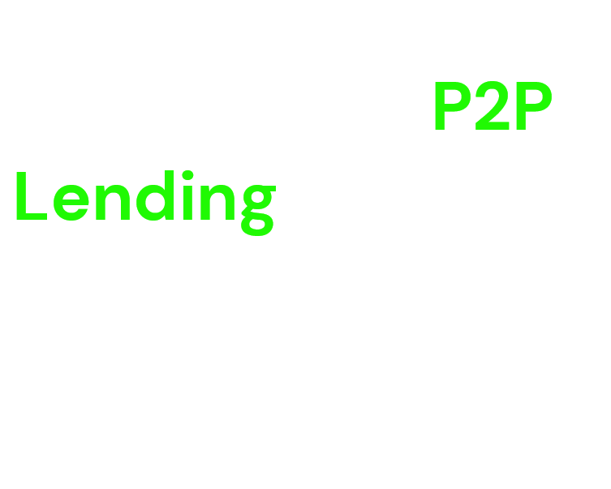
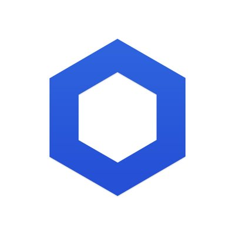

# **Welcome To Flex Protocol!**

- ### [What is Flex ?](#what-is-flex-1)
- ### [Problems Solved](#why-does-flex-exist-and-what-problem-does-it-solve)
- ### [Flex Core Features](#core-features)
- ### [Common Terminologies](#some-terminologies-used-in-flex-protocol)
- ### [Important Links](#links)
- ### [Technologies Used](#technologies-used-1)
- ### [Closing Thoughts](#closing-thought-and-possible-improvements)

# **What is Flex?**

Flex is is a peer to peer lending marketplace protocol that provides lenders and borrowers with a platform to connect with each other and agree on deals that favor both parties. Flex can be thought of as kind of your regular nft marketplace but instead of NFT's we have lender and borrower loans. Some key features of flex that would be discussed in better below are renegotiation between a lender and a borrower to agree on a deal, allowing lenders and borrowers to chat and agree on a deal, customized loan details where a lender or borrower can decide their over collateralization ratio, margin cutoff, interest rate, time limit etc.
Flex is deployed on Fantom Testnet and written in Vyper Language deployed with ApeWorx ensuring transparency and security in the lending and borrowing process.

## **Why Does Flex Exist And What Problem Does It Solve?**

Flex exist to solve the problem or provide an alternative to pool lending and borrowing. As successful as that has been flex seems to offer as the name suggests more flexibility to how loans work. Giving borrows and lenders more opportunities to be flexible wit their loan process such as proposing LENDER or BORROWER loan, Accepting and reviewing renegotiations, flexibility with overcollateralization ratio, margin cutoffs, interest rate etc. Flex exist for this sole purpose.

## **CORE FEATURES**


### **Peer To Peer Lending**

Peer To Peer Lending on flex give slenders and borrowers the opportunity to directly agree on terms without the fate of their loan details relying on the overall pool but instead only the security of the contracts itself.

### **Flexibility Of Loan Details**

With Flex lenders and borrrowers have the flexibility do decide their loan details such as the time limit on loans, the margin cutoff, the collateral ratio, interest rates etc.

### **Loan Marketplace Methodology**

Flex uses a loan marketplace approach similar to the "nft marketplace mantra" that users are already used to, this time instead of NFT's flex uses loans. Flex has two types of loans: A lender loan proposed by a lender and A borrower loan proposed by a borrower. All Loans are visible in the marketplace for users to see and interact with throught proposing of renegotiations, chatting with lender/borrowers about deals etc.



# **Some Terminologies Used In Flex Protocol**

### **Collateral Ratio**

Collateral ratio is a term that refers to the ratio of the value of the collateral pledged for a loan compared to the amount of the actual loan.It's expressed in percentage. Always keep your collateral ratio high above 100% else your loan would be under collateralized from the get go! Also Factor in your interest rate as a lender.

An example, if a borrower wants to take out a loan of $10,000 and offers collateral worth 15,000, the collateral ratio would be 150% ($15,000 divided by $10,000). The higher the collateral ratio, the lower the risk for the lender as they have more security in the form of collateral in case the borrower defaults on the loan.

### **Margin Cutoff**

Margin cutoff refers to the minimum amount of collateral required to maintain a loan position on flex. It is the threshold value that, if the value of the collateral falls below it, the borrower or trader will need to provide additional collateral to maintain the position or face liquidation. Again Your Margin Cutoff Should be above 100% avoid significant losses.

An example of a margin cutoff using 130% using a lender loan.
If a borrower deposits some collateral and borrows some amount from you, because asset prices are always changing his collateral can lose its value as time goes by. Your margin cutoff watches his debt against his collateral deposited. As soon as his collateral falls below 130% of his debt, his loan is valid to be liquidated.

### **Interest Rate**

This is simply the interest rate the lender receives at the end of his loan and is paid back to him in the same asset he lent.

### **Lender Loan And Borrower Loan**

A lender loan is a loan that is proposed by someone who is willing to loan out some asset in return for interest on creation of a lender loan. The lender locks up his deposit into the loan with his terms proposed listening to offers from other users and renegotiating accordingly to what suits all parties.

A borrower loan on the other hand is quite similar to a lender loan but instead with this loan the borrower deposits some collateral into the loan looking for a lender who's willing to lend him funds based of terms that are rengotiatable like collateral ratio, interest etc.

Note : There are actually more sub divisions of loans which are private and public loans. You can specify the user you're only willing to renegotiate with or make it open to the public. This is called Access Control on the website

### **Time Limit**

Loans on flex possess an option to have a time limit to be liquidated. Once a loan has exceeded its time limit the loan can be liquidated even without being undercollateralized.

### **Health Status**

Health status is a colored circle that indicates the safety of your position on a loan as a borrower. When its green you're doing a good job staying over collateralized, when its yellow you're at risk of becoming liquidated if price changes fast uexpectedly and red means your loan is ready to be liquidated by a liquidator.

### **Loan States**

Loans on flex have 3 different states.
PROPOSED state means the loan hasnt been accepted and is still in negotiation process. ACCEPTED as the name states means a loan has been accepted by a lender or borrower depending on the loan type. FULFILLED means the loan has been repaid or liquidated to be repaid.

### **Loan Buyouts**

Loan Buyouts exist on accepted loans. They allow other users to propose buyout to an existing loan offering the lender some amount of money to take ownership of the loan.
Once the lender agrees to a buyout he loses ownership of the loan and recives the buyout amount proposed.

### **Proposed Terms**

While a loan is accepted both a lender and borrower have the ability to propose new terms to each other in hope that one may accept the terms. For instance a borrower proposing a better margin cutoff for his loan to the lender to help him avoid easy liquidation.

### **Principal And Collateral Type**

There are currently only four major types of assets

1. Flex (you can get from the faucet in the links section of this readme)
2. Mock USDT (same faucet)
3. Link Token (chainlink official faucet)
4. FTM

The collateral type refers to the type of asset the borrower wishes to pledge as collateral.
The principal type refers to the type of asset the lender is willing to lend.

## **A FLEX TALE**

This is basically a scenario of how flex works. You can try this out on the live demo.

- Starting Price Point `FTM:1 USD` and `FLEX:1.5USD`
- Francis Has some FTM he wishes to borrower and earn interest from. So he goes to flex to find a borrower that fits the amount of interest he's willing to receive and collateral type he'll receive incase of a liquidation.
- Francis proposes a lender loan with the following details `collateral rati:150%`, `margin cutoff:120%`, `interesrt: 5%` and he's willing to borrow `20 FTM` and collect a collateral of `Flex` tokens.
- Jane has some flex tokens and has seen Francis loan on flex and likes the idea of the loan but feels the collateral ratio is too high so she pushes a renegotiation to reduce the collateral ratio to `140%`
- Francis sees this and after a few conversations with Jane on flex he agrees to her renegotiation and accepts it.
- Jane then accepts this loan by paying a collateral worth more than `140%` of her debt to the loan which is `29.4 Flex` tokens.
- Janes debt automatically increases to the borrow amount plus interest which is `21 FTM`
- Now if all goes well and Jane comes back she reapys her `21 FTM` loan debt to Francis and takes back her collateral.
- If all doesnt go as planned and for some reason Jane isnt monitoring her collateral and the price of her collateral being `Flex` drops to `0.8 Usd`. You can do the math..
- She has a collateral deposit of `29.4 flex` tokens which are now worth `23.52 usd` comapred to her debt of `ftm` which is worth `21 usd` without the margin cutoff but if we include the margin cutoff which we should her liquidation point is `25.2usd`
- since the `23.52 usd` collateral is now less than her `25.2 usd `deposit she canbe liquidated
- On a normal level anyone is allowed to liquidate a loan, so as soon as the price drops below the margin cutoff a liquidator would liquidate the loan and get the liquidation percentage releasing the collateral to the lender.
- If there was a time limit on this loan and it was exceeded before the price dropped the loan would also be valid for liquidation.

## **Technologies Used!**

### **Fantom**


All contracts that surround the flex protocol were deployed to fantom testnet.

### **Vyper Language And ApeWorx** 🐍 🦧

Vyper is an EVM pythonic smart contract language. Flex is built with vyper from the ground up and developed using apeworx framework for scripting and testing.

Code Snippet

```vyper
# Loan Details
struct Loan:
    borrower: address
    lender: address
    margin_cutoff: uint256
    collateral_ratio: uint256
    fixed_interest_rate: uint256
    borrow_amount: uint256
    time_limit: bool
    time_amount: uint256
    collateral_type: address
    collateral_deposited: uint256
    principal_type: address
    current_debt: uint256
    access_control: bool
    state: bytes32
    loan_type: uint256
```

### **Chainlink Price Oracles**



Chainlink Price Oracles are used in flex to handle loan price changes and monitor whenloans are valid to be liquidated

### **Next JS, The Graph, React Moralis**

Next JS along with the graph and react moralis were used to build out the frontend section of the website and making of the smart contract function calls.

## **Links**

- [Smart Contract Repository](https://github.com/franfran20/flex_project)
- [Frontend Repository](https://github.com/franfran20/flex_client)
- [Flex And Usdt Faucet](https://flex-client-rhih.vercel.app/faucet)
- [Video Submission Link]()
- [Live Site](https://flex-client-rhih.vercel.app/)
- Flex Token Address : `0x476cFd8523e767eA40Eb094AAc07D9A2e5F17Ef1`
- Mock Usdt Address : `0xE14B4e52d15a3704502096b5aF28D4e2cd83Fb70`
- Flex Core Address: `0x107269369cdE7f73A9E21707003176ebC9fF7290`

# **Closing Thought And Possible Improvements**

Thanks for reading all the way through, hopefully you can see the same power I see with flex and support the success of teh protocol all the way through. I'd be updating the price of the flex token from time to time to allow users who are playing around to experience liquidations with flex tokens as pricipal or collateral type.

Some possible improvements are :

- Better user experience and error handling (**solo builder and found out about the hackathon 2 weeks in**).
- More Advanced Rigid Testing Of The Protocol.
- Cleaner Code.

Alright then!
